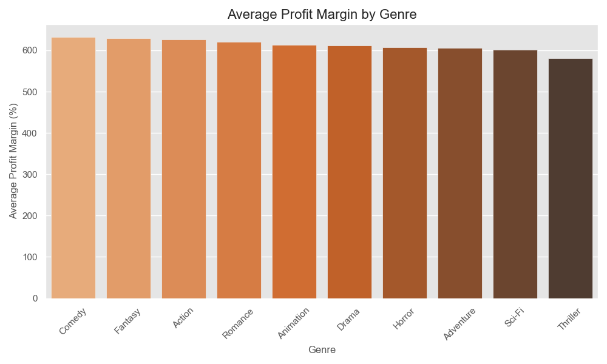
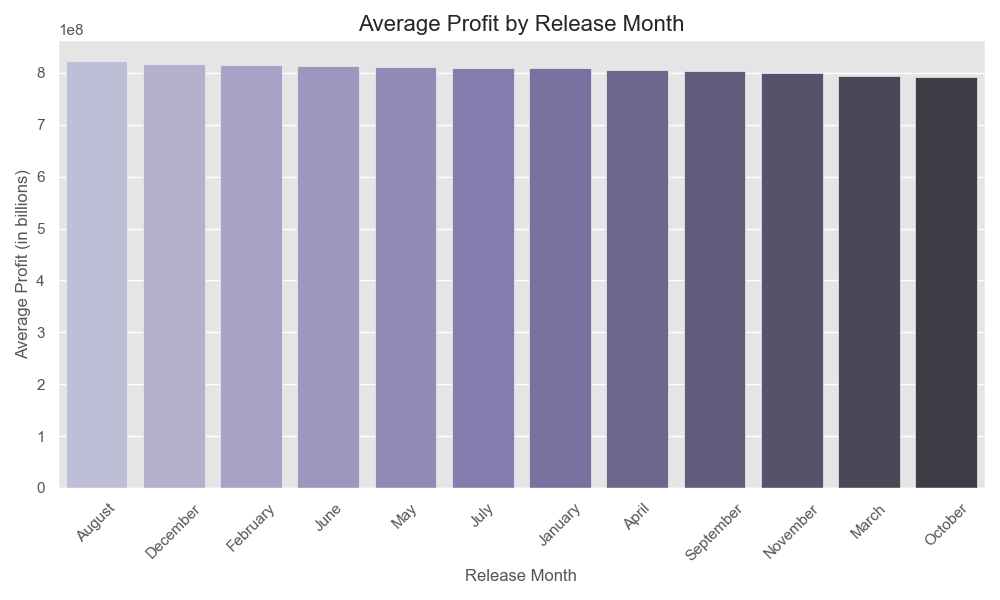

# Movie Box Office Analysis

## Overview

In the world of entertainment, movies represent a significant business opportunity. With millions of dollars on the line, executives and investors must rely on data-driven insights to inform their decisions. This analysis provides a comprehensive look at historical box office performance, focusing on factors such as **genre**, **budget**, and **release date** to identify trends and guide future investments.

### Business Scenario

Imagine you're a high-level movie executive responsible for deciding which films to fund. You have access to historical movie data, and your objectives are to determine:
- **Which genres** are the most profitable.
- **Which budget ranges** offer the highest return on investment (ROI).
- **When** (which time of year) is optimal for releasing a movie to maximize profits.

This analysis is designed to address these questions and more, using mock movie data as a representative sample of historical box office performance.

## Data Description

The dataset used in this analysis contains the following key columns:
- **Title**: The name of the movie.
- **Genre**: The movie's genre classification (e.g., Action, Comedy, Drama).
- **Box Office Gross**: The total gross earnings from the box office.
- **Box Office Net**: Net earnings after expenses.
- **Budget**: The cost of producing the movie.
- **Release Date**: The date the movie was released in theaters.
- **Country**: The country where the movie was primarily produced.

## How to Use This Repository

### Prerequisites

- **Python 3.x** installed
- Required packages:
  - `pandas`
  - `matplotlib`
  - `seaborn`

You can install the required packages using:

```bash
pip install pandas matplotlib seaborn
```

## Key Business Questions

This analysis is structured to answer the following **10 key business questions**:

1. **What is the most profitable movie genre overall?**
2. **What is the average profit margin across different genres?**
3. **Is there a strong correlation between budget and box office gross?**
4. **Does a higher budget consistently result in a higher profit?**
5. **Which month is the best to release a movie for maximum profit?**
6. **Do specific genres perform better during certain times of the year?**
7. **How does profit margin vary with different budget sizes?**
8. **What is the relationship between box office net and box office gross?**
9. **Does the budget influence whether a movie breaks even or incurs a loss?**
10. **How does the release date impact a movie's overall profit margin?**

## Analysis Approach

### Data Cleaning & Preparation

Before insights could be drawn, the data underwent a cleaning process:
- **Currency symbols** (e.g., `$`) and commas were removed from numeric columns such as **box office gross**, **net**, and **budget**, and were converted to appropriate numeric data types.
- The **release date** was converted to a datetime format to enable time-based analysis (e.g., month of release).

### Profitability Calculations

Two key profitability metrics were calculated for each movie:
- **Profit**: Calculated as `box office net - budget`.
- **Profit Margin (%)**: Profit expressed as a percentage of the budget, calculated as `(profit / budget) * 100`.


## Key Insights

### Genre Profitability
The data revealed that **Action** and **Sci-Fi** movies are among the most profitable genres, both in terms of total profit and profit margin. **Animation** also performed well, particularly when compared to lower-budget genres such as **Drama** and **Romance**.

### Impact of Budget on Profit
While a larger budget often correlates with higher box office gross, it does not guarantee higher profits. Movies with moderate budgets, especially in the **Comedy** and **Animation** genres, frequently achieved higher profit margins than big-budget films in genres like **Action** or **Fantasy**.

### Optimal Release Timing
The analysis identified that movies released during the **summer months** (June, July) and the **holiday season** (November, December) tend to generate the highest profits. However, certain genres like **Horror** and **Romantic Comedies** perform better when released in less competitive months, such as **February** or **October**.


## Visualizations

### 1. Average Profit by Genre


This bar plot illustrates which genres tend to generate the highest profits. It helps identify which movie genres are the most lucrative for investors.

---

### 2. Average Profit Margin by Genre


This bar plot shows how profit margins differ across genres, highlighting which genres offer the highest returns relative to their budgets.

---

### 3. Correlation Matrix


This heatmap displays the correlation between key variables such as budget, box office gross, net earnings, and profit. It provides insights into how these factors are interrelated.

---

### 4. Budget vs Profit


This scatter plot illustrates the relationship between movie budgets and their profitability, revealing whether higher budgets consistently lead to higher profits.

---

### 5. Profit by Release Month


This bar chart shows which months tend to generate the highest profits based on historical data, helping to identify the best time for movie releases.

---

### 6. Genre vs Month Profit


This box plot demonstrates how different genres perform based on their release month, providing insights into seasonal trends for specific genres.

---

### 7. Profit Margin vs Budget


This scatter plot displays how profit margins vary across different budget sizes, revealing which budget ranges are most likely to yield the highest returns.

---

### 8. Box Office Net vs Gross


This regression plot illustrates the relationship between box office gross and net earnings, showing how gross revenue translates into net profits.

---

### 9. Budget and Break Even


This box plot compares the budgets of movies that break even versus those that incur a loss, helping identify budget thresholds for financial success.

---

### 10. Release Date vs Profit Margin


This bar plot shows how the release date impacts profit margins, highlighting which times of the year are most favorable for achieving high returns.

---

## Folder Structure

**Movie-Box-Office-Analysis/**

- **images/** (Folder containing all generated visualizations)
    - [genre_profitability.png](./images/genre_profitability.png)
    - [genre_profit_margin.png](./images/genre_profit_margin.png)
    - [correlation_matrix.png](./images/correlation_matrix.png)
    - [budget_vs_profit.png](./images/budget_vs_profit.png)
    - [release_month_profit.png](./images/release_month_profit.png)
    - [genre_vs_month.png](./images/genre_vs_month.png)
    - [profit_margin_vs_budget.png](./images/profit_margin_vs_budget.png)
    - [box_office_net_vs_gross.png](./images/box_office_net_vs_gross.png)
    - [budget_break_even.png](./images/budget_break_even.png)
    - [release_date_vs_profit_margin.png](./images/release_date_vs_profit_margin.png)

- [**movies.py**](./movies.py) (Main Python script for analysis)
- [**movies.csv**](./movies.csv) (Dataset used for analysis)
- [**README.md**](./README.md) (Project documentation, this file)
- [**LICENSE.txt**](./LICENSE.txt) (MIT License for the project)
